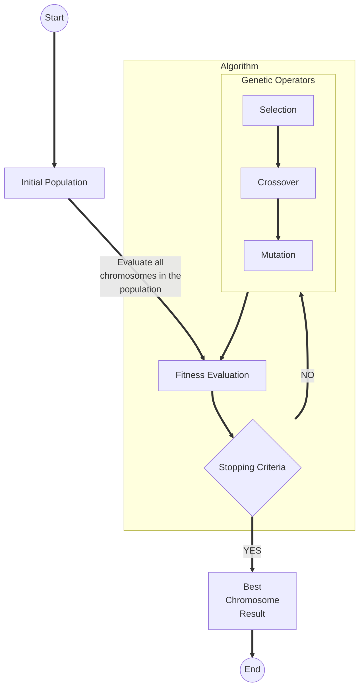

# PYGENMET MANUAL

[](https://twitter.com/imarranz)


## Introduction

This repository contains the documentation of [pygenmet](https://github.com/imarranz/pygenmet), a genetic algorithms package developed in Python.

This book includes a collection of functions and examples, written in Python, that shows how to use the PyGenMet package.


## Rendering the manual

To compile or generate the documentation with [Jupyter Book](https://jupyterbook.org/) try this from console:

Clone the repository:

```
git clone https://github.com/imarranz/pygenmet-manual.git
```


Render the manual with [JupyterBook](https://github.com/imarranz/pygenmet-manual.git):

```
jupyter-book build pygenmet-manual/
```

## Citation

I publish each release of PyGenMet on Zenodo and here is a list of version:

|Version|Date|DOI|
|-------|----|---|
| [v1.0.0](https://github.com/imarranz/pygenmet/releases/tag/v1.0.0) | August 22, 2021 |  |
 
If you'd like to cite this package, instead of a specific version, use the following DOI: [https://doi.org/10.5281/zenodo.5233539](https://doi.org/10.5281/zenodo.5233539). Here is the bibtex entry for the book:


```
@software{ibon_martinez_arranz_2021_5233539,
  author       = {Ibon Martínez-Arranz},
  title        = {imarranz/pygenmet: v1.0.0},
  month        = aug,
  year         = 2021,
  publisher    = {Zenodo},
  version      = {v1.0.0},
  doi          = {10.5281/zenodo.5233539},
  url          = {https://doi.org/10.5281/zenodo.5233539}
}
```

Last update on the website: [www.imarranz.com/pygenmet-manual/](http://www.imarranz.com/pygenmet-manual/docs/index.html)


